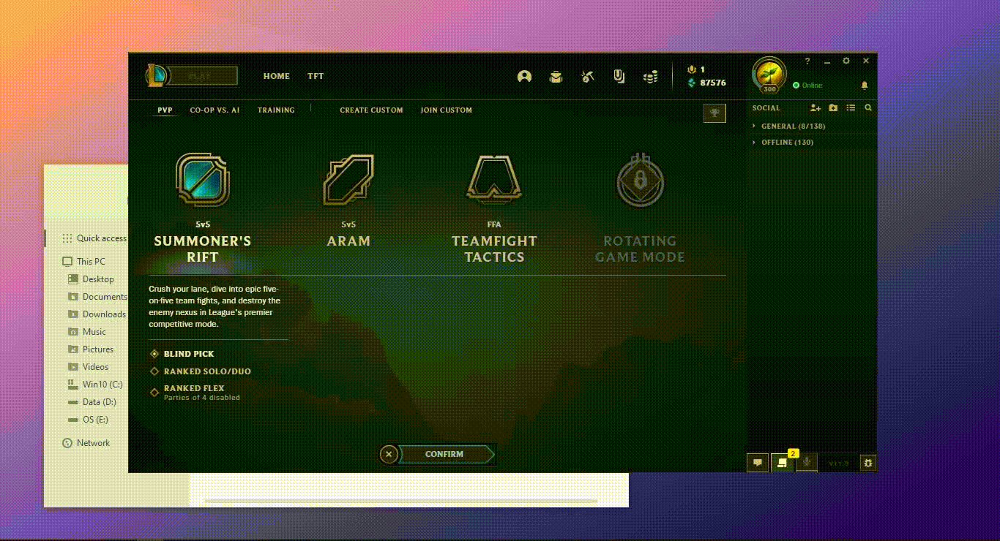

> [!] Cách boost skin miễn phí trong post này đã bị fix. Hiện tại đã có cách
> mới, nhưng nó chỉ hoàn toàn miễn phí trên server của Riot và cũng là cách cuối
> cùng nên không thể share một cách công khai.

# Story

Cũng hơn một năm rồi kể từ khi post
[pick-lock Yasuo](/posts/super-fast-pick-lock) của mình ra mắt, đúng là dạy hư
bọn trẻ khi mà đi đâu cũng thấy sử dụng API tràn lan. May mà Garena cũng im lặng
ngắm nhìn 😄

Nhớ hồi tháng 8 năm ngoái thì có một bạn share
[league-profile-tool](https://github.com/MManoah/league-profile-tool), cái này
chủ yếu dùng để mod profile trên League Client, thực hiện request đến LCU và còn
một tính năng nữa... đó là boost skin miễn phí trong chế độ ARAM.

> [?] Battle Boost là một tính năng dùng để mở khóa skin ngẫu nhiên của tướng đã
> pick trong các chế độ random tướng (AR). Khi kết thúc trận thì người mở khóa
> sẽ nhận thêm **200 THL**.

Lúc ấy, mình cố đào source của tool ra thì thấy người ta dùng API này:

```
POST /lol-champ-select/v1/team-boost/purchase
```

Thử đi thử lại nhiều lần nhưng vẫn fail, tức không boost được skin trong ARAM.
Trong khi đó thì một số tool tương tự vẫn hoạt động bình thường. Mình cũng không
chắc là sai chỗ nào nữa 😅

Về cơ bản thì cái nút BOOST (Tăng điểm) chỉ có thể click được khi bạn có ít nhất
30 RP, ta có thể mô tả bằng đoạn JS sau:

```js
wallet.on('rp-change', (value) => {
  $('#btn-boost').prop('disabled', value < 30)
})

$('#btn-boost').on('click', () => {
  if (wallet.getRP() >= 30) {
    wallet.purchaseRP(30)
    battleBoost.activate()
  } else {
    alert('Mày nghèo lắm con trai ạ!')
  }
})
```

- `wallet` là object quản lý tiền tệ
- Dùng jQuery cho dể biểu diễn, `btn-boost` sẽ là ID của nút BOOST
- Cái thông báo khi fail phải là...


Vậy là chỉ cần gọi `battleBoost.activate()` là có ngay skin mà không tốn một RP
nào cả.

Theo mình đoán thì patch
[11.2](https://na.leagueoflegends.com/en-us/news/game-updates/patch-11-2-notes/#patch-aram-balance-changes)
có nhiều update cân bằng ARAM, nên có thể Riot sẽ fix bug này.

Nhưng thực tế thì đến tận patch 11.4, vì patch 11.3 có chế độ ARURF và có thể
boost skin tương tự như ARAM, còn lại chắc bạn cũng biết rồi đấy.

| Patch             | Scheduled Date             |
| ----------------- | -------------------------- |
| 11.2              | Thursday, Jan 21, 2021     |
| 11.3              | Wednesday, Feb 3, 2021     |
| <mark>11.4</mark> | <mark>Thursday, Feb 18, 2021</mark> |
| 11.5              | Wednesday, Mar 3, 2021     |

Cái gì đến cũng sẽ đến thôi, và rồi API ở trên cũng không còn dùng được nữa.
Dưới đây là một số report đầu tiên:

- https://github.com/XHXIAIEIN/LeagueCustomLobby/issues/1
- https://www.elitepvpers.com/forum/league-legends/4883795-how-people-still-aram-boost.html
- https://bbs.125.la/thread-14666922-2-1.html

```js
battleBoost.activate = function () {
  if (wallet.getRP() >= 30) {
    // ...
  }
}
```

Trong FAQ của league-profile-tool cũng có
[ghi rõ](https://github.com/MManoah/league-profile-tool/blob/16c00946772049d1a0b618675ca0cdf4dc2cac45/src/app/faq/faq.component.html#L17-L21):

> The old method got patched, there are other **new methods** out there. It will
> not be included in this program.

# Nghiên cứu

Đầu tiên hãy nhìn response của cái API trên:

```terminal
curl -X POST /lol-champ-select/v1/team-boost/purchase
___
{
  "errorCode":"RPC_ERROR",
  "httpStatus":500,
  "implementationDetails":{},
  "message":"Error response for POST /lol-lobby-team-builder/champ-select/v1/team-boost/purchase: Unable to purchase team boost"
}
```

Phần endpoint trong message trả về rõ là khác với API. Cũng không khó hiểu đâu,
plugin **lol-lobby-team-builder** mới chính là base trong việc tạo team đến chọn
tướng trước khi vào trận, nên mọi endpoint liên quan đều đẩy hết vào nó.

```
POST /lol-lobby-team-builder/champ-select/v1/team-boost/purchase
```

Trước patch 11.6 thì message trả về khác với ở trên:

> Error response for POST
> /lol-lobby-team-builder/champ-select/v1/team-boost/purchase: Unable to
> purchase team boost: Received status Error: INVALID_STATE instead of expected
> status of OK from request to **teambuilder-draft:activateBattleBoostV1**

Vậy là API ở trên vẫn chưa phải là endpoint cuối cùng, nhưng mà
`teambuilder-draft:activateBattleBoostV1` là gì nhỉ?

Đến đây mình thực sự không biết nên làm gì nữa, thế là quyết định dùng **IDA
Pro** để phân tích LeagueClient.exe.


Trên là các method name của một class C++ liên quan đến boost skin trong LCU
core. Ta có thể tìm đến reference code của chúng và đặt breakpoint để debug, sau
đó tìm this và function address là có thể invoke vào method, tuy nhiên việc này
khá phức tạp nên mình bỏ qua.

```cpp
const char *__cdecl class Riot::MaybeType<class Riot::Failure,struct Riot::Client::ActiveBoosts::LCDS::SummonerActiveBoostsDTO>(void)
```

Hãy nhìn chữ **LCDS**, nó là viết tắt của **LifeCycle Data Services**, là một
service proxy trong League Client cũ vẫn còn được sử dụng. Để giao tiếp được với
LCDS phải thông qua giao thức RTMP, nó không giống như việc bắn request vào
microservice thông qua HTTP.

Thật may mắn khi một
[issue](https://github.com/Pupix/rift-explorer/issues/111#issuecomment-605556121)
mà mình từng comment có xuất hiện từ khóa này:

> Couldn't change lobby: Error creating lobby: Error response for **POST
> /lol-login/v1/session/invoke**: **LCDS** invoke to
> gameService.createPracticeGame failed...

Dùng API này có thể invoke vào các service proxy, bao gồm cả LCDS.

```
POST /lol-login/v1/session/invoke
```

API này có 3 param như sau:

- `destination`: tên của service proxy
- `method`: tên phương thức cần invoke
- `args`: tham số truyền vào dưới dạng JSON

Nhưng mà invoke kiểu gì?


Sau một hồi tìm kiếm thì có ngay
[document thần thánh](https://github.com/loldevs/leaguespec/wiki/RTMP-Service-Methods#lcdsserviceproxy)
😀

> Được biết thì cái docs này sinh ra từ việc dịch ngược mã nguồn client cũ.

Trong này có nhiều method, nhưng theo logic thì ta cần gọi một hàm để boost, đó
chính là `call`. Docs cũng có ghi rõ `call` cần 4 tham số truyền vào...

Tham số **#1** là UUID của một sảnh chờ (lobby), được tạo ra từ
`com.riotgames.platform.common.utils.GUID`, đố bạn namespace này của ngôn ngữ
nào?

> Là ActionScript, không phải Java đâu! Tuy nó rất giống là vì syntax và runtime
> của AS, tất cả đều dựa trên Java. LoL client cũ sử dụng Adobe AIR và phần lớn
> được viết bằng AS.

Theo như một số API khác thì có thể bỏ qua tham số này, hệ thống sẽ lấy UUID của
lobby hiện tại. Nhưng theo docs thì phải là chuỗi nên mình cho chuỗi rỗng luôn.

Tiếp theo thì hai tham số **#2** và **#3** lần lượt là **game mode** và
**procedure call**, có sẵn luôn đây này:

- **teambuilder-draft**
- **activateBattleBoostV1**

Và cuối cùng là tham số **#4** là một chuỗi chứa tham số khi call, theo hàm C++
lúc nãy thì có một `void` bên trong, tức là không có tham số nào, vậy ta gán
chuỗi rỗng.

Ta được API hoàn chỉnh như sau:

```
POST /lol-login/v1/session/invoke
  destination=lcdsServiceProxy
  method=call
  args=["","teambuilder-draft","activateBattleBoostV1",""]
```

Tại đây, ta có thể dùng **curl** để request, nhưng phải có port và auth token
(pass).

```bash
curl -k -g -X POST -u riot:PASS \
  https://127.0.0.1:PORT/lol-login/v1/session/invoke \
  -d destination=lcdsServiceProxy \
  -d method=call \
  -d args=["","teambuilder-draft","activateBattleBoostV1",""]
```

- -k để bật insecure mode (bypass invalid HTTPS cert của client)
- -g để có thể dùng dấu ngoặc trong URL

> Thường thì **curl** có sẵn trong Windows, được build bằng MSVC. Còn những bản
> build bằng MingGW hay Cygwin khi request đều sẽ fail.

Bước tiếp theo là viết script để gom mọi thứ vào một.

# Triển khai

Năm nay thì đổi style mới đơn giản hơn, thay vì dùng JS trên trình duyệt web thì
mình chơi hẳn Batch script luôn. Với lại tương tác trực tiếp trên **cmd** sẽ rất
tiện.

Đầu tiên là tạo một file có tên **aram-booster.bat**

```batch aram-boster.bat
@echo off & setlocal

endlocal
```

Mình sẽ dùng con bài **WMIC** cũ để lấy port và auth token:

```terminal
WMIC PROCESS WHERE name='LeagueClientUx.exe' GET commandline
```

Output của nó chứa toàn bộ command line và vài dòng thừa, vì vậy phải tách ra và
lưu vào biến.

```batch aram-booster.bat
@echo off & setlocal

+for /f "tokens=* USEBACKQ" %%a in (
+  `"WMIC PROCESS WHERE name='LeagueClientUx.exe' GET commandline | findstr ."`
+) do set cmdline=%%a
```

- `USEBACKQ` để `for` có thể đọc cả khoảng trắng và xuống dòng
- Kết hợp `findstr .` để gom hết output của `WMIC` thành một

Khi `for` chạy sẽ đọc qua từng dòng, khi đó dòng cuối cùng chứa command line sẽ
được lưu vào biến `cmdline`.

Tiếp theo là tách port và auth token:

```batch aram-booster.bat
) do set cmdline=%%a

+for %%a in (%cmdline%) do (
+  for /f "tokens=1,2 delims==" %%i in (%%a) do (
+    if "%%i"=="--app-port" set "port=%%j"
+    if "%%i"=="--remoting-auth-token" set "pass=%%j"
+  )
+)
```

- For thứ nhất sẽ đọc qua từng argument
- For thứ hai sẽ split argument
- Hai dòng if để lấy port và pass

Trong trường hợp League Client chưa được mở sẵn hoặc script không được cấp quyền
Admin thì biến `port` chắc chắn chưa được định nghĩa, ta sẽ báo lỗi:

```bat aram-booster.bat
+if not defined port goto :err
endlocal
```

Và label `:err`

```batch aram-booster.bat
:err
+echo Failed to boost!
+echo Please make sure League Client is opened,
+echo    and run script again as Administrator.
endlocal
```

Mình thêm một label `:end` để dừng thoát và kết thúc

```batch aram-booster.bat
+:end
+timeout /t 5 /nobreak
endlocal
```

Khi request thành công, response trả về JSON có dạng:

```
{"body": ... }
```

Mình sẽ cho `curl` vào for để lấy response:

```batch aram-booster.bat
+for /f "tokens=* USEBACKQ" %%a in (
+  `curl -s -g -k -X POST -u riot:%pass% ^
+    https://127.0.0.1:%port%/lol-login/v1/session/invoke ^
+    -d "destination=lcdsServiceProxy" ^
+    -d "method=call" ^
+    -d "args=["""",""teambuilder-draft"",""activateBattleBoostV1"",""""]"`
+) do set "resp=%%a"

:err
```

- `-s` để bật silent mode, `curl` chỉ trả về duy nhất response
- Response sẽ được lưu trong biến `resp`

Tiến hành kiểm tra response và hiện thông báo:

```batch aram-booster.bat
) do set "resp=%%a"

+set success={"body"
+if defined %resp% (
+  if "%resp:~0,7%"=="%success%" (
+    color A
+    echo Your game is BOOSTED!
+    goto :end
+  )
+)
```

- Lệnh if ngoài sẽ kiểm tra biến `resp` được định nghĩa hay chưa
- Lệnh if bên trong kiểm tra response
- Biến `success` chứa pattern của response hợp lệ, do không dùng được dấu nháy
  kép trong if nên mình tách nó ra
- Nếu thành công thì ta nhảy đến end luôn

Giờ thì tạo một trận ARAM và test thử thôi nào!



# Bonus

Sau khi viết xong cái **aram-booster** này bằng Batch thì mình cũng có implement
nó bằng vài ngôn ngữ khác. Bạn xem tại đây nhé:
[nomi-san/aram-booster](https://github.com/nomi-san/aram-booster).

Mình check trên Github thì thấy có nhiều repo dùng API tương tự, nhưng tất cả
đều...

- Copy từ thằng này:
  [x00bence/lol-aram-boost](https://github.com/x00bence/lol-aram-boost)
- Hoặc có thể do exploit từ repo này:
  [vperpl/sex-ploits](https://github.com/vperpl/sex-ploits)


Thật ra họ không cần dài dòng như mình, chỉ cần dùng tool
[frostycpu/FinalesFunkeln](https://github.com/frostycpu/FinalesFunkeln) và bỏ ra
một ít RP để boost là bắt được API call thôi 😅
