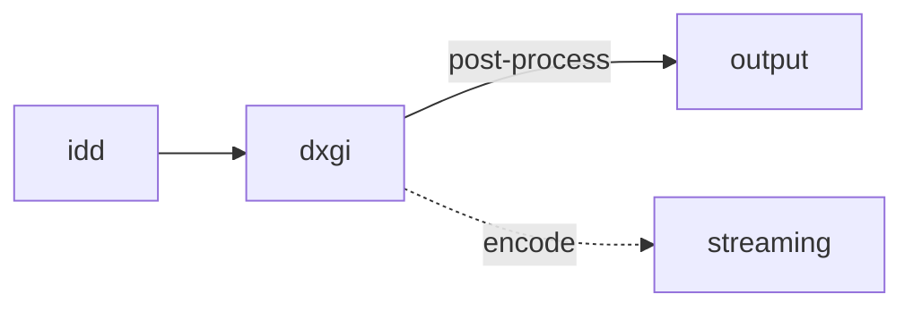
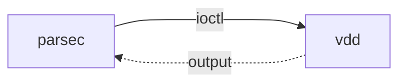

Trong quá trình dựng host cho cloud gaming solution, mình gặp phải một vấn đề đó
là khi ngắt tất cả cổng xuất hình (output) thì phía client chỉ còn màn hình đen.
Điều này thường thấy khi sử dụng các app remote desktop như AnyDesk hay Parsec.

Cũng khá dễ hiểu khi mà các phần mềm trên đều sử dụng công nghệ giống nhau để
capture toàn bộ màn hình desktop hoặc cổng output. Một điều nữa là trên các
desktop environment, khi không có một desktop nào thì các cửa sổ sẽ gần như vô
định hình hay không tồn tại theo đúng nghĩa.

Khi MMO tool bắt đầu phổ biến thì VPS Windows Server là lựa chọn số một để treo
tool. Để giữ cho các cửa sổ không bị lệch hay minimized thì các MMO thủ thường
chữa cháy bằng cách remote RDP vào VPS để sinh màn hình ảo.

Màn hình ảo hay **virtual display** để chỉ màn hình bao gồm cả desktop được sinh
ra bằng phần mềm, hiểu đơn giản thì nó giống việc bạn cắm màn hình vào máy tính
nhưng lại không cần một màn hình vật lý nào. RDP sử dụng
[Mirror Driver](https://learn.microsoft.com/vi-vn/windows-hardware/drivers/display/mirror-drivers)
để sinh màn hình ảo trên Windows Vista và 7. Đến Windows 8 thì nó được thay thế
hoàn toàn bởi
[Remote Display Driver](https://learn.microsoft.com/en-us/windows-hardware/drivers/display/remote-display-drivers),
và cuối cùng là Indirect Display Driver trên Windows 10 và 11.

## Indirect Display Driver

[Indirect Display Driver](https://learn.microsoft.com/en-us/windows-hardware/drivers/display/indirect-display-driver-model-overview)
(IDD) được giới thiệu từ Windows 10 1601, đây là một loại user-mode driver có
khả năng tạo màn hình ảo vượt trội hơn các driver tiền nhiệm. Nó cho phép truy
cập trực tiếp DXGI swapchain của màn hình thay vì dùng GDI như trước, điều này
cho phép bạn encode output phục vụ cho streaming hoặc thêm Direct3D shader để
thay đổi kết quả đầu ra của hình ảnh desktop.



Để tạo một IDD bạn phải dùng
[WDK](https://learn.microsoft.com/en-us/windows-hardware/drivers/download-the-wdk)
như bao driver khác và clone code từ
[microsoft/Windows-driver-samples](https://github.com/microsoft/Windows-driver-samples/tree/wdk_driver_updates/video/IndirectDisplay)
hoặc [roshkins/IddSampleDriver](https://github.com/roshkins/IddSampleDriver).
Trong code này, ta có thể thêm các độ phân giải và tần số quét tùy thích, có thể
lên đến 8K miễn là GPU của bạn đủ khỏe.

Xét về khả năng chơi game thì các project IDD mã nguồn mở đều có chung nhược
điểm là không thể đạt được tần số quét mong muốn. Ví dụ thiết lập màn hình ảo
với 144hz nhưng nó chỉ đạt trung bình 60hz hoặc bị drop liên tục. Điều này sẽ
ảnh hưởng trực tiếp đến lượng khung hình (FPS) khi capture desktop.

Sau nhiều thử nghiệm thì mình nhận thấy các thông số trong driver rất quan trọng
đối với hiệu năng của màn ảo, ngoài ra timing trong
[EDID](https://en.wikipedia.org/wiki/Extended_Display_Identification_Data) cũng
là yếu tố ảnh hưởng đáng kể, vì các project trên đều sử dụng một mẫu EDID đơn
giản. Lúc này vì thời gian có hạn nên mình phải tìm giải pháp khác thay thế.

## Parsec Virtual Display Driver

Parsec Virtual Display Driver (VDD) là một loại IDD được tạo riêng dành cho app
Parsec — một ứng dụng remote desktop với ping cực thấp và cho trải nghiệm chơi
game cực mượt. VDD chỉ đơn thuần hỗ trợ tạo thêm màn hình ảo khi không có màn
hình vật lý nào được cắm vào máy host, độ phân giải lên đến **4k@240hz** và có
thể tạo thêm 3 màn hình ảo khác khi bạn sử dụng gói trả phí.

Phải nói đây là một IDD hoàn hảo, qua nhiều bài test chơi game thì màn hình ảo
của nó thực sự cho hiệu năng gaming vượt trội hơn các project hiện có như
[virtual-display-rs](https://github.com/MolotovCherry/virtual-display-rs),
[RustDeskIddDriver](https://github.com/fufesou/RustDeskIddDriver)... Một phần
cũng nhờ EDID tích hợp của VDD được timing rất kỹ, đôi khi chạy game trên cùng
cấu hình thì nó cho FPS cao hơn cả màn hình vật lý.

### Sử dụng độc lập VDD

Sau khi theo dõi API call trong app Parsec thì mình nhận thấy nó chỉ gửi code
vào VDD để tạo và tương tác với màn hình ảo thông qua hàm **DeviceIoControl**.
Điều này có nghĩa là ta có thể sử dụng VDD hoàn toàn độc lập mà không cần phụ
thuộc vào app Parsec hay phải trả phí để thêm màn hình ảo.



Hàm
[DeviceIoControl](https://learn.microsoft.com/en-us/windows/win32/api/ioapiset/nf-ioapiset-deviceiocontrol)
được sử dụng chủ yếu để giao tiếp với user-mode driver từ các ứng dụng thông
thường, gửi control code (IOCTL) kèm input buffer và nhận kết quả trả về thông
output buffer.

```cpp
BOOL DeviceIoControl(
  HANDLE  hDevice,     DWORD  dwIoControlCode,
  LPVOID  lpInBuffer,  DWORD  nInBufferSize,
  LPVOID  lpOutBuffer, DWORD  nOutBufferSize,
  ...
```

Tham số đầu tiên của hàm là device handle trỏ đến adapter của VDD. Adapter có
GUID là `{00b41627-04c4-429e-a26e-0265cf50c8fa}` và phải dùng
[SetupAPI](https://learn.microsoft.com/en-us/windows-hardware/drivers/install/setupapi)
để lấy ra đường dẫn cuối rồi dùng hàm `CreateFile` để tạo device handle.

Nếu bạn lười thì có thể dùng đường dẫn cứng này và thay `{x}` bằng số từ 0 đến f
(hệ thập lục) để lấy handle một cách nhanh chóng:

```
\\?\root#display#000{x}#{00b41627-04c4-429e-a26e-0265cf50c8fa}
```

Tham số thứ 2 của hàm là một IOCTL đã được thiết lập bên trong driver, đây là
các code mà app Parsec gửi vào driver:

1. **VDD_IOCTL_VERSION** (0x0022e010) Lệnh này dùng để truy vấn phiên bản minor
   của driver, ví dụ v0.41 thì kết quả trả về là 41. Output là 4 bytes nên có
   thể nó bao gồm cả major version theo dạng kết hợp của 2 số nguyên 16-bit.

2. **VDD_IOCTL_ADD** (0x0022e004) Cắm một màn hình ảo và trả về index của nó,
   output là số nguyên 32-bit. Ngoài ra ta có thể check event-log để biết màn
   hình ảo đã được cắm vào.

3. **VDD_IOCTL_REMOVE** (0x0022a008) Gỡ một màn hình ảo tương ứng với index được
   truyền vào, input là số nguyên 16-bit BE.

4. **VDD_IOCTL_UPDATE** (0x0022a00c) Lệnh này dùng để giữ cho các màn hình ảo
   được cắm vào luôn "sống", nếu không được gửi sau hơn 100ms thì tụi nó sẽ tự
   ngắt kết nối.

Kết hợp các lệnh trên ta có thể dễ dàng tạo ra một ứng dụng để điều khiển VDD,
hoặc dựng API để tích hợp vào project khác.

### Các hạn chế của VDD

#### 1. Không hỗ trợ HDR

Từ phiên bản IddCx **1.10** trở đi thì HDR và 10+ bit depth có thể được bật từ
trong driver (chỉ hỗ trợ Windows 11), nhưng VDD chỉ sử dụng IddCx 1.4 nên chắc
chắn là không có. Bạn không nên chỉnh sửa EDID trong VDD để thêm HDR vì nó hoàn
toàn không có tác dụng.

Thật ra HDR cũng không quá cần thiết và nếu hỗ trợ sẽ kén người dùng cũng như
phần cứng, nhưng vẫn hi vọng Parsec sẽ ra mắt bản build khác sử dụng IddCx mới
và có HDR.

#### 2. Giới hạn tùy chọn độ phân giải

VDD chỉ hỗ trợ tối đa thêm 5 độ phân giải tùy chọn bằng cách thêm thủ công vào
registry, bạn có thể xem hướng dẫn
[tại đây](https://support.parsec.app/hc/en-us/articles/4423615425293-VDD-Advanced-Configuration).
Thực tế thì 5 cũng khá đủ rồi, và VDD đã được thiết lập sẵn 25+ độ phân giải cho
các loại màn hình desktop phổ biến.

### Source code và app

Toàn bộ mã nguồn mình đã up trên repo
[nomi-san/parsec-vdd](https://github.com/nomi-san/parsec-vdd).

Trong này bao gồm 2 phần là core và app. Phần **core** gồm một file header C/C++
có thể dễ dàng tích hợp vào các project khác. Phần **app** là một production app
được viết bằng C# giúp quản lý các màn hình ảo được tạo từ VDD cùng các tiện
ích. Ngoài ra thì file **README** cũng có rất nhiều thông tin về VDD và các
hướng dẫn khác.

#### Bonus: Giấy phép và bản quyền

Đầu năm 2024, có một bạn bên Hàn gửi mail hỏi về giấy phép để sử dụng parsec-vdd
cho mục đích thương mại (commercial use). Trong repo này mình sử dụng license
MIT nên hoàn toàn không vấn đề gì, nhưng vấn đề ở VDD là driver dưới dạng
freeware và phụ thuộc vào Parsec, tốt nhất cứ liên hệ với họ.

Bạn đó đã gửi mail cho Parsec nhưng không có phản hồi nên mình đề xuất 2 giải
pháp chống cháy:

1. Mua license của Parsec SDK, nó chắc chắn bao gồm phần giao tiếp với driver.
   Mức giá trung bình từ 1 triệu đô và không bán cho cá nhân, họ sẽ từ chối nếu
   bạn là doanh nghiệp nhỏ.
2. Trả tiền cho gói Warp hoặc Teams của Parsec, xét theo đúng luật thì bạn đang
   trả tiền để mở khóa sử dụng VDD.

Hiện tại cloud gaming solution bên mình không còn sử dụng VDD nữa, thay vào đó
là dùng HDMI dongle vì phải build toàn bộ host bằng máy vật lý, kết hợp với tùy
chỉnh EDID timing và display mode trong NVIDIA control panel để vượt qua giới
hạn phần cứng.
